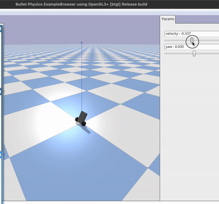

# Self balancing robot simulation

## What / Why
This repository contains the code necessary to run a simulation of a two wheeled self balancing robot. The robot uses a Linear–quadratic regulator (LQR) controller to maintain balance. All code needed to run the simulation in a PyBullet Real-Time Physics Simulation environment is included in this repository.

Why? The aim is to eventually switch the LQR controller implementation out for a neutral network trained through reinforcement learning. However, for now this simulation is for testing that a simulation can accurately model real world behavior when given the same inputs including robot physical characteristics, LQR gains, etc.

## Setting up the development environment

Clone the repo

    git clone https://github.com/lachlanhurst/balance-robot-pybullet-sim.git
    cd balance-robot-pybullet-sim

Recommend using the conda environment file included in this repository. Attempting to pip install pybullet was not a smooth experience. It does require that [Anaconda is installed](https://docs.anaconda.com/anaconda/install/). These commands will create and activate a new `robot-simulation` conda env.

    conda env create -f conda-environment.yaml
    activate robot-simulation

## Calculating LQR parameters and running the simulation

Note: in this repository the robots physical properties are stored in two locations. [`calculate_lqr_gains.py`](./src/lqr_gains/calculate_lqr_gains.py) and [`robot-02.urdf`](./src/simulation/robot-02.urdf), these need to match for the robot to balance.

Run the following commands to generate the LQR gains parameters.

    python ./src/lqr_gains/calculate_lqr_gains.py

This will generate a single line of output similar to that shown below. It will change depending of the parameters of your robot and changes to the weighting matrix.

    LQR_K = [ -2.140216584823796, -0.03501370844016193, 2.8184444430994133e-17, 2.236067977499798]

The above line then needs to be updated within the [`robot_lqr.py`](./src/simulation/robot_lqr.py) file (the above is already included, only update if parameters have changed).

Then to run the simulation.

    cd ./src/simulation
    python simulate_robot.py

The robot can be controlled using the two parameter sliders (velocity and yaw) in the PyBullet user interface.

## Issues

There's no noise in the simulated environment, yet the controller still needs a filter applied to the pitch dot, and angular velocity components of the LQR calc (line 70, [`robot_lqr.py`](./src/simulation/robot_lqr.py)). Please drop an issue in this repo if you're able to explain why this is needed here. The real physical robot also requires these filters to dampen oscillation.

## Acknowledgements

The robot model definition [`robot-02.urdf`](./src/simulation/robot-02.urdf) is heavily based off what yconst used in [their example](https://github.com/yconst/balance-bot).

Code for calculating the LQR gains comes directly from the [Pictorus blog](https://blog.pictor.us/lqr-control-of-a-self-balancing-robot/). This whole post is great as an accessible introduction to using LQR controllers for self balancing robots.

